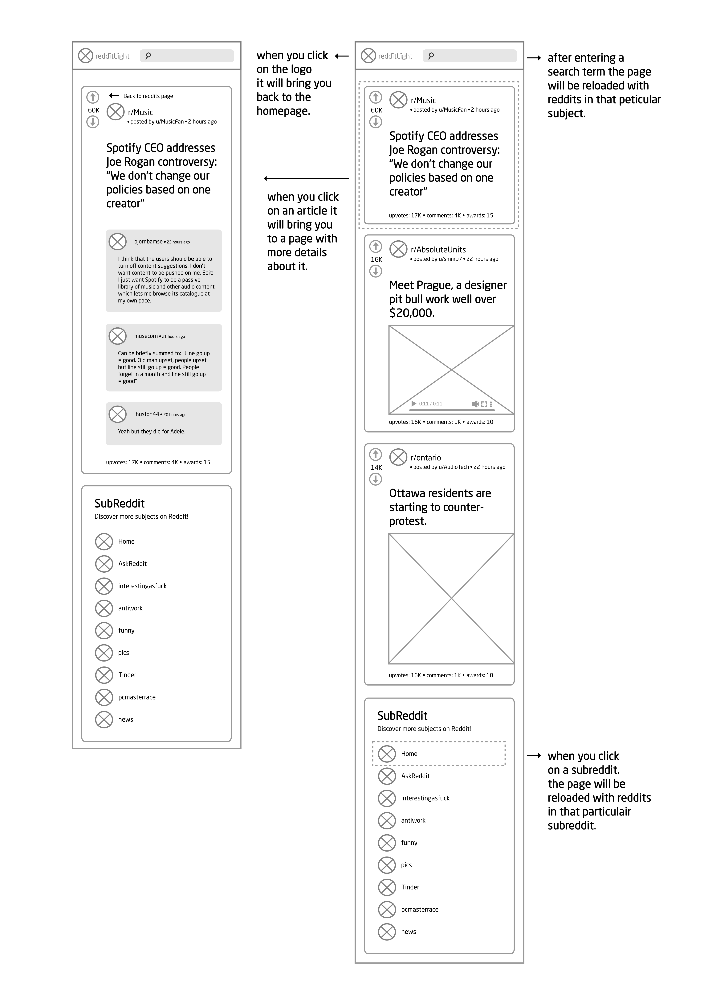
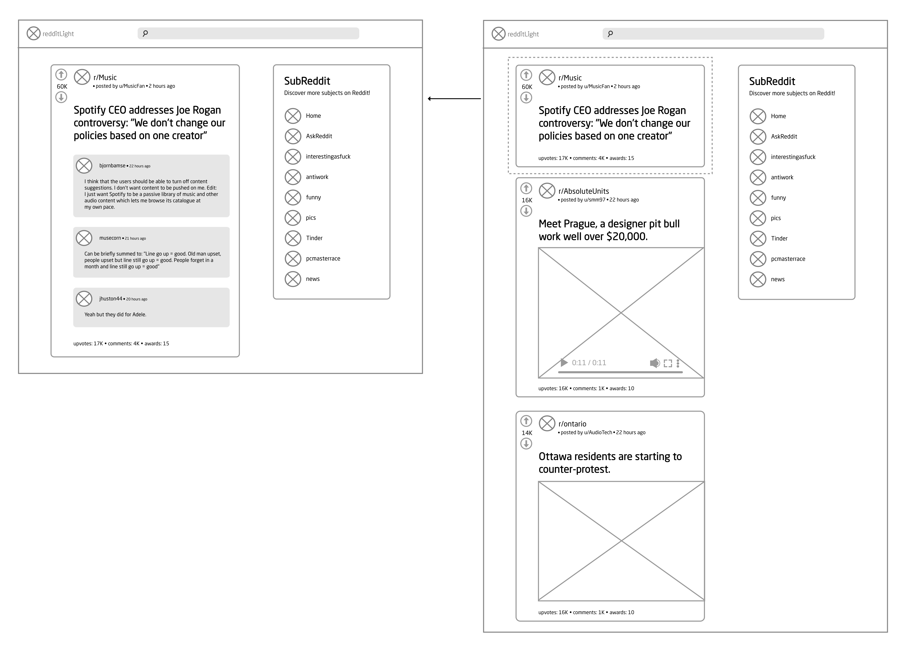

# Reddit Light

This webapp was a project of codecademy were I study the Front-end Engineer path. The task was to make a 'lighter' version of de reddit website for learning purposes.

## Wire frames

I made a view wire frames for the project. They give a good over view of the webapp.

### mobile wire frames

\
&nbsp;

### laptop / desktop wire frames

\
&nbsp;

## Technologies used

This webapp is build with:
javascript, react version 17.0.2, react-router-dom version 6.2.1, react-redux version 7.2.6,
html and css.

## Features

In this app you can search Reddits in three different ways. On the homepage you see directly the most popular reddits on that moment. In the search field at the top of the webapp you can add a search term to search in all the reddits. the third option is a list of subreddits at the left were you can choose all the reddit in a subreddit. on the homepage you can directly see the reddits with the title, author, likes, in witch subreddit they are, the time they created, awards and the number of the comments. When you click on the reddit you get redirected to a different page with more info about the reddit.

## Future work

In the future I will do things differently. One example is the design of the mobile page. It isn't mobile friendly enough. I made first the design for the laptop / desktop pages and when I tried to shrink the design for mobile use it didn't turn out so well.
when people have large fingers I don't know if they could navigate properly through the pages. In the future I make first the design for mobile use and then scale it up for laptop/ desktop. I learned a lot from this project and can't wait to make more projects like this in the future.
